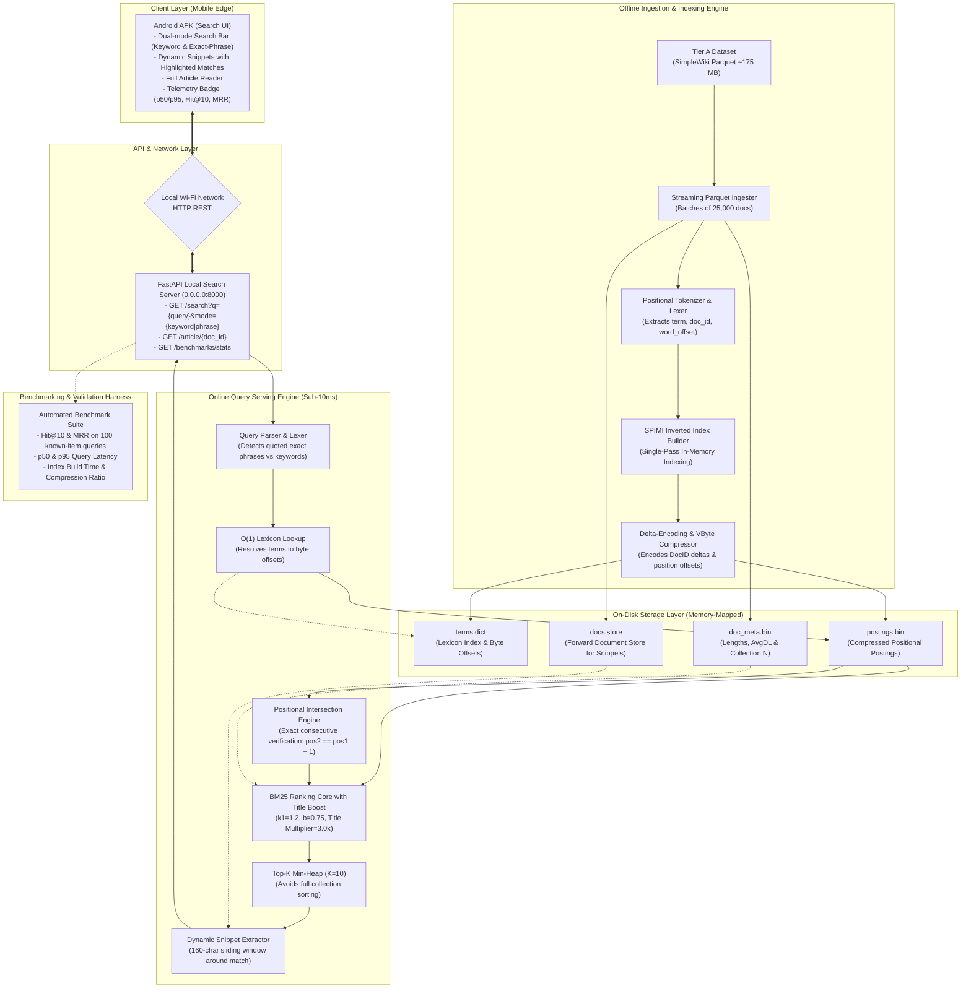

# Wikipedia Search Engine Architecture Diagram (Mermaid)

Copy and paste the code block below directly into [mermaid.live](https://mermaid.live) or mermaid.io:

```mermaid
flowchart TD
    subgraph CLIENT["Client Layer (Mobile Edge)"]
        APK["Android APK (Search UI)\n- Dual-mode Search Bar (Keyword & Exact-Phrase)\n- Dynamic Snippets with Highlighted Matches\n- Full Article Reader\n- Telemetry Badge (p50/p95, Hit@10, MRR)"]
    end

    subgraph API["API & Network Layer"]
        WIFI{"Local Wi-Fi Network\nHTTP REST"}
        FASTAPI["FastAPI Local Search Server (0.0.0.0:8000)\n- GET /search?q={query}&mode={keyword|phrase}\n- GET /article/{doc_id}\n- GET /benchmarks/stats"]
    end

    subgraph OFFLINE["Offline Ingestion & Indexing Engine"]
        DATA["Tier A Dataset\n(SimpleWiki Parquet ~175 MB)"]
        INGEST["Streaming Parquet Ingester\n(Batches of 25,000 docs)"]
        TOK["Positional Tokenizer & Lexer\n(Extracts term, doc_id, word_offset)"]
        SPIMI["SPIMI Inverted Index Builder\n(Single-Pass In-Memory Indexing)"]
        COMPRESS["Delta-Encoding & VByte Compressor\n(Encodes DocID deltas & position offsets)"]
    end

    subgraph STORAGE["On-Disk Storage Layer (Memory-Mapped)"]
        DICT["terms.dict\n(Lexicon Index & Byte Offsets)"]
        POSTINGS["postings.bin\n(Compressed Positional Postings)"]
        META["doc_meta.bin\n(Lengths, AvgDL & Collection N)"]
        STORE["docs.store\n(Forward Document Store for Snippets)"]
    end

    subgraph ONLINE["Online Query Serving Engine (Sub-10ms)"]
        QPARSE["Query Parser & Lexer\n(Detects quoted exact phrases vs keywords)"]
        LOOKUP["O(1) Lexicon Lookup\n(Resolves terms to byte offsets)"]
        INTERSECT["Positional Intersection Engine\n(Exact consecutive verification: pos2 == pos1 + 1)"]
        BM25["BM25 Ranking Core with Title Boost\n(k1=1.2, b=0.75, Title Multiplier=3.0x)"]
        HEAP["Top-K Min-Heap (K=10)\n(Avoids full collection sorting)"]
        SNIP["Dynamic Snippet Extractor\n(160-char sliding window around match)"]
    end

    subgraph METRICS["Benchmarking & Validation Harness"]
        BENCH["Automated Benchmark Suite\n- Hit@10 & MRR on 100 known-item queries\n- p50 & p95 Query Latency\n- Index Build Time & Compression Ratio"]
    end

    %% Flow Connections
    APK <==> WIFI
    WIFI <==> FASTAPI

    DATA --> INGEST
    INGEST --> TOK
    TOK --> SPIMI
    SPIMI --> COMPRESS
    COMPRESS --> DICT
    COMPRESS --> POSTINGS
    INGEST --> META
    INGEST --> STORE

    FASTAPI --> QPARSE
    QPARSE --> LOOKUP
    LOOKUP -.-> DICT
    LOOKUP --> POSTINGS
    POSTINGS --> INTERSECT
    POSTINGS --> BM25
    INTERSECT --> BM25
    META -.-> BM25
    BM25 --> HEAP
    HEAP --> SNIP
    STORE -.-> SNIP
    SNIP --> FASTAPI

    FASTAPI -.-> BENCH
```
